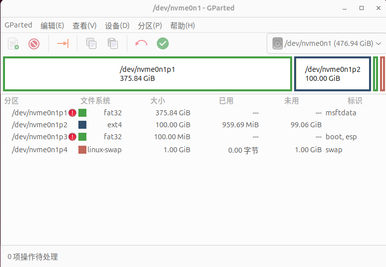
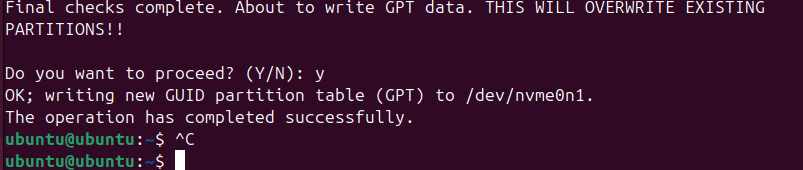
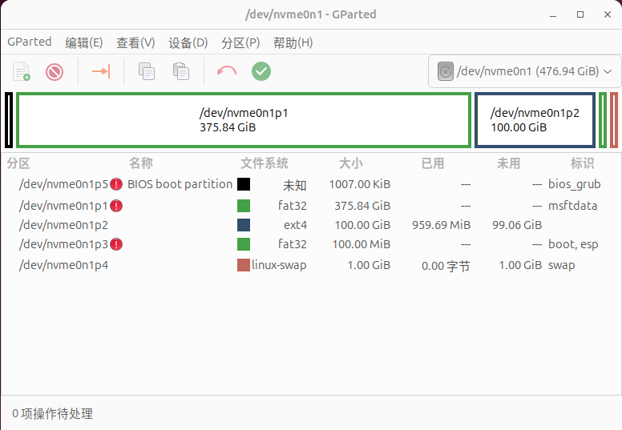
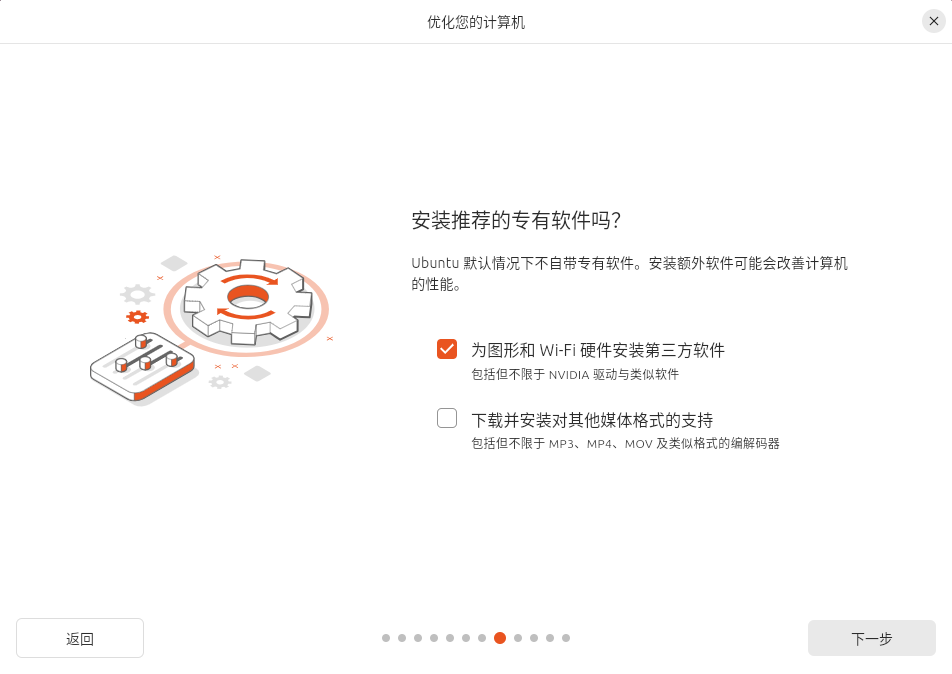
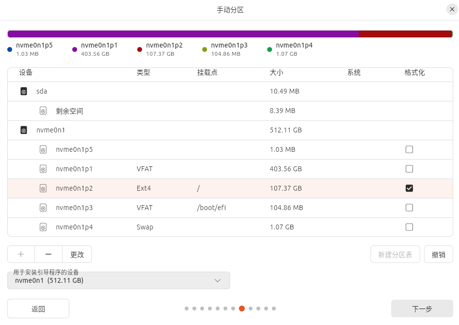

Title : 将Ubuntu安装在移动设备并支持UEFI和BIOS双引导启动

Date : 2023-6-10

Tag : Linux

---

## 将Ubuntu安装在移动设备并支持UEFI和BIOS双引导启动
#### 1、准备工作

- 一个固态硬盘或者U盘（至少64GB）

- 一台Windows系统电脑

- VMware pro 15+

#### 2、去Ubuntu官网下载镜像

    官网地址：<u><https://ubuntu.com/></u>

    官网中文站：<u><https://cn.ubuntu.com/></u>

    建议下载6.5以上内核的版本，原因是旧的内核有些地方与现在的新电脑不兼容，本文使用的是Ubuntu24.04版本

    下载好镜像文件后记住路经，等会要用到

#### 3、使用Vmware pro创建一个Ubuntu虚拟机

    确保硬盘或U盘里面的数据不再需要

    打开VMware pro > 创建新的虚拟机 > 自定义 > 兼容性15.x > 稍后安装操作系统

    选择Liunx Ubuntu64位，然后一直下一步，这里虚拟磁盘类型根据自己的来选择，U盘就选SCSI，固态就根据类型选SATA或NVme

    创建新的虚拟磁盘，大小0.01GB（因为根本用不到），一直下一步直到完成

    菜单栏选择虚拟机 > 设置 > USB控制器 > 改为3.1

    CD/DVD > 使用ISO映像文件 > 路径就是刚刚下载好的Ubuntu镜像文件位置

    选项 > 高级 > 固件类型改为UEFI > 确定

    如果是雷电3接口连接的固态硬盘可以直接使用物理磁盘映射，不需要USB桥接。菜单栏选择虚拟机 > 设置 > 添加 > 硬盘 > NVme > 使用物理磁盘 > 使用整个磁盘，**<mark>记住你固态硬盘的盘号别选错成本机的磁盘了</mark>** > 完成

#### 4、安装Ubuntu

    开启虚拟机，菜单栏 > 虚拟机 > 可移动设备 > 选择你的设备 > 连接（如果之前使用的物理磁盘则不需要这一步）

    选择Try or Install Ubuntu，

    进入桌面，语言选中文，一直下一步，选择试用Ubuntu

    找到Gparted打开，在右上角选择设备（看容量就知道选哪个了），菜单栏 > 设备 > 创建分区表 > 选择gpt > 确定

    接下来就是分区了，右键未分配分区 > 新建，如果有在Windows之间交换数据的情况，可以把第一个分区设为fat32，Windows下能识别（如果没这需求就不用了）

    再接着给主系统分区，建议是至少40GB吧，然后esp分区至少100MB，最后分区完成如下图（仅参考）

这里有些版本的Ubuntu怎么都会出现一个未知的1MB空间，正好是用来添加 bios_grub标记的。没出现也不用管，像我这里也没出现，后面照样可以添加标记。（这里是什么原因没出现暂时不清楚）

然后在虚拟机中打开终端输入

```
sudo gdisk /dev/nvme0n1
n
# 默认编号，回车
# 默认开始位置，回车
# 默认结束位置，回车
EF02 # EF02 就是 bios_grub
p # 看到 Name 有 BIOS boot partition 就可以了
w
y
```

显示成功就行了

最后分区就变成这样，多了一个bios_grub标记，这个就是用来BIOS引导启动的



    

#### 5、UEFI安装

    双击桌面的安装Ubuntu，选择中文（简体），一直下一步，安装更新这里建议跳过，不然很慢，交互安装 > 默认集合，这里一定要勾选为图形和WIFI硬件安装第三方软件。

    没有安装这些驱动很可能在某些电脑笔记本上面无法显示画面，或是连接不了WIFI。然后下一步，手动分区，选择Ext4分区，更改，挂载点选择 /，用于安装的引导程序的设备选择整个磁盘而不是分区

然后下一步，输入用户名密码之类的，选择时区，最后点击安装，等待完成

#### 6、BIOS安装

    退出虚拟机后 > 设置 > 选项 > 高级，固件类型改为BIOS。

    重新打开虚拟机，还是选择Try or Install Ubuntu，进入桌面后打开终端输入

```
sudo mount /dev/nvme0n1p2 /mnt
sudo grub-install --target=i386-pc --recheck --boot-directory=/mnt/boot /dev/nvme0n1
```

    这里的nvme0n1p2是你安装系统的位置，我的系统安装在nvme0n1这个磁盘的p2位置，所以就是nvme0n1p2，如果你是使用的U盘或者其他通过USB连接的移动磁盘，那就应该是sdb2

    如果报错，请检查是否正确标记了bios_grub

    重启虚拟机，去掉ISO镜像文件，尝试BIOS启动

    成功启动，大功告成！
