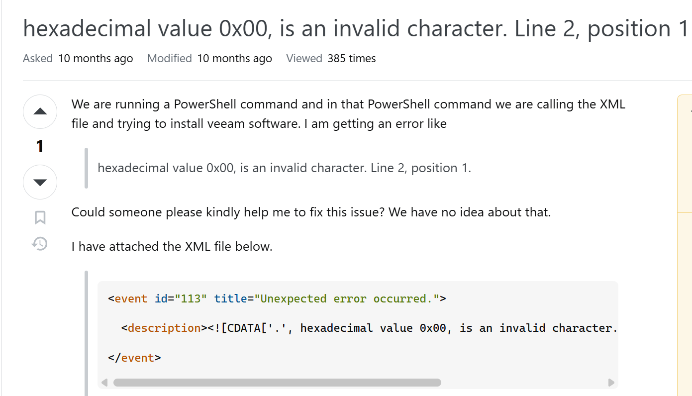

Title : 读取App.config报错十六进制0x00是无效字符

Date : 2025-6-20

Tag : C# .NET

---

## 读取App.config报错System.Configuration.ConfigurationErrorsException

起因是写了个控制台应用，新建App.config去保存数据库连接字符串，大致内容为：

```xml
<?xml version="1.0" encoding="utf-8" ?>
<configuration>
  <connectionStrings>
    <add name="DefaultConnection"
         connectionString="Data Source=.;Initial Catalog=TempModelDB;User ID=sa;Password=123456;Trust Server Certificate=True"
         providerName="System.Data.SqlClient" />
  </connectionStrings>
</configuration>
```

结果程序运行报ConfigurationErrorsException错误，位置就在ConfigurationManager.ConnectionStrings["DefaultConnection"].ConnectionString;这里。

看了下异常信息，提示我在第2行位置1的地方多了一个无效字符，反复用不同编码方式打开都没有发现


只好去谷歌找答案，在stackoverflow中有人也遇到同样问题




发现是由于文件本身编码格式和首行声明的格式不一致导致的，文件是utf-16le编码，声明的却是utf-8

改为：

```XML
<?xml version="1.0" encoding="utf-16LE" ?>
```

或者将文件重新编码保存为utf-8就好了。

原理估计是Visual Studio为了兼容早期的.NET Framework项目，将App.config文件保存的是utf-16的编码，但模板却用的现代的模板，于是就报错了。
