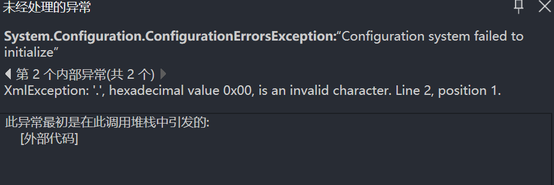

Title : 读取App.config报错十六进制0x00是无效字符

Date : 2025-6-20

---

## 读取App.config报错System.Configuration.ConfigurationErrorsException

起因是写了个控制台应用，新建App.config去保存数据库连接字符串，大致内容为：

```xml
<?xml version="1.0" encoding="utf-8" ?>
<configuration>
  <connectionStrings>
    <add name="DefaultConnection"
         connectionString="Data Source=.;Initial Catalog=TempModelDB;User ID=sa;Password=123456;Trust Server Certificate=True"
         providerName="System.Data.SqlClient" />
  </connectionStrings>
</configuration>
```

结果程序运行报ConfigurationErrorsException错误，位置就在ConfigurationManager.ConnectionStrings["DefaultConnection"].ConnectionString;这里。

看了下异常信息，提示我在第2行位置1的地方多了一个无效字符，反复用不同编码方式打开都没有发现



只好去谷歌找答案，发现将第一行的uft-8改为utf-16le

```XML
<?xml version="1.0" encoding="utf-16LE" ?>
```

成功运行。
